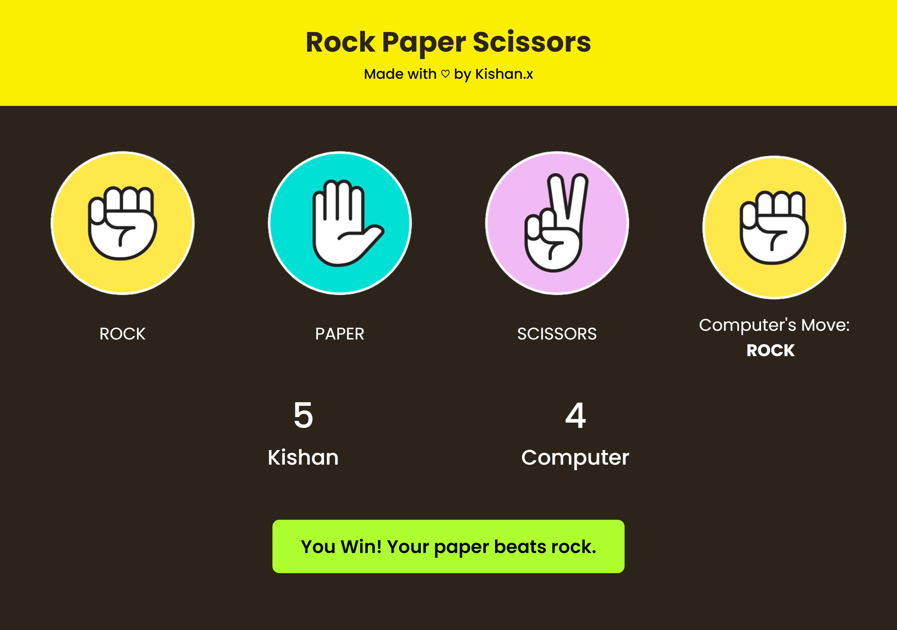

# Rock Paper Scissors

Welcome to the Rock Paper Scissors game! Challenge the computer and see who emerges victorious.


## Table of Contents
- [Introduction](#introduction)
- [Features](#features)
- [Getting Started](#getting-started)
- [How to Play](#how-to-play)
- [Screenshots](#screenshots)
- [Contributing](#contributing)
- [License](#license)

## Introduction

This project is a simple implementation of the classic Rock Paper Scissors game. It's designed for a fun and interactive experience, allowing users to compete against the computer.

## Features

- User-friendly interface
- Real-time scoring
- Computer move display
- Dynamic messaging

## Getting Started

To get started, simply clone the repository to your local machine and open the `index.html` file in a web browser.

```bash
git clone https://github.com/kx56/rock-paper-scissors.git
cd rock-paper-scissors
```

## How to Play

- Open the game in your browser.
- Enter your name when prompted.
- Choose between Rock, Paper, or Scissors.
- See the computer's move and find out who wins.
- Enjoy and have fun!


## Screenshots


##Contributing

Contributions are welcome! If you find a bug or have an enhancement in mind, feel free to open an issue or submit a pull request.
